# Linux Whisper Input

A lightweight, high-performance, and completely local voice-to-text dictation service for Linux (Wayland / X11). 

By using a client-server (C/S) architecture, this service keeps the Whisper model and CUDA context permanently preloaded in GPU memory (VRAM) as a background systemd user daemon. When you press the global shortcut (`Meta+H`), it records audio from your microphone, runs instant GPU-accelerated transcription, and inserts the text directly at your cursor.

No heavy GUI overhead, no startup latency, and 100% offline.

---

## 🚀 Key Features

*   **Zero Startup Latency**: Model & CUDA context are resident in VRAM. Transcription starts instantly upon triggering.
*   **State-of-the-Art Model**: Uses the highly optimized `large-v3-turbo` Whisper model in `float16` precision via CTranslate2.
*   **PipeWire Native**: Captures audio natively via `sounddevice` / PortAudio.
*   **Robust Auto-Typing**:
    *   **Wayland**: Copies transcribed text to the clipboard (`wl-clipboard`) and simulates typing via `ydotool` (virtual keyboard driver) or `wtype`.
    *   **X11**: Simulates typing via `xdotool`.
*   **Smart Silence Detection**: Auto-stops recording using built-in Voice Activity Detection (VAD) rules when you stop talking (default 1.2s silence threshold).
*   **Systemd Integration**: Managed as a standard `systemd --user` service.

---

## 🛠️ Architecture

```mermaid
sequenceDiagram
    autonumber
    actor User as User (Presses Meta+H)
    participant Hotkey as KDE Global Hotkey
    participant Trigger as trigger.py (Client)
    participant Daemon as daemon.py (Server)
    participant GPU as GPU VRAM (CTranslate2)
    participant Audio as Mic (PipeWire)
    participant Desktop as Active Window (Wayland/X11)

    Note over Daemon, GPU: System Start: Pre-load model & CUDA context
    Hotkey->>Trigger: 1. Launch trigger.py
    Note over Trigger: Captures active GUI environment variables
    Trigger->>Daemon: 2. Unix Socket signal {command: "toggle"}
    
    rect rgb(20, 30, 45)
        Note over Daemon: State: IDLE -> RECORDING
        Daemon-->>User: 3. Desktop Notification "🎤 Recording..."
        Daemon->>Audio: 4. Open audio input stream
    end
    
    User->>Hotkey: 5. Stops speaking (Presses Meta+H again / VAD silent timeout)
    Hotkey->>Trigger: 6. Launch trigger.py
    Trigger->>Daemon: 7. Unix Socket signal {command: "toggle"}
    
    rect rgb(20, 30, 45)
        Note over Daemon: State: RECORDING -> TRANSCRIBING
        Daemon-->>User: 8. Desktop Notification "🔄 Transcribing..."
        Daemon->>Audio: 9. Stop audio stream
        Daemon->>GPU: 10. GPU Inference (float16)
        GPU-->>Daemon: 11. Return transcribed text
    end
    
    Daemon->>Desktop: 12. Write to clipboard & simulate Ctrl+V Paste
    Daemon-->>User: 13. Desktop Notification "✓ Complete"
    Note over Daemon: State: TRANSCRIBING -> IDLE
```



---

## 📦 Prerequisites & Installation

### 🤖 Agent / One-Key Quick Installation

If you are using an AI coding assistant (Agent) or want a fully automated one-key setup, you can simply run:

```bash
chmod +x install.sh && ./install.sh
```

This script will automatically:
1. Install system pacman dependencies (`portaudio`, `notify-send`, `wl-clipboard`, `xdotool`, `ydotool`).
2. Add your user to the `input` group and configure udev rules for virtual keyboard injection.
3. Initialize the Python virtual environment and install dependencies.
4. Download the `large-v3-turbo` model from ModelScope.
5. Register, reload, and start the systemd user service.
6. Programmatically bind the `Meta+H` global shortcut in KDE Plasma 6.

*Note: If you want to do a manual, step-by-step setup instead, proceed with the sections below.*

### 1. Install System Dependencies

Ensure you have the required audio and input injection packages installed on Arch Linux:

```bash
sudo pacman -Syu
sudo pacman -S portaudio notify-send wl-clipboard xdotool ydotool
```

### 2. Configure `ydotool` for Wayland (Optional but Recommended)

To allow the background service to simulate keystrokes on Wayland without root privileges:

1. Add your user to the `input` group:
   ```bash
   sudo usermod -aG input $USER
   ```
2. Enable and start the systemd user service for `ydotool`:
   ```bash
   systemctl --user enable --now ydotool.service
   ```
3. Set the socket environment variable in your profile (e.g., `~/.bashprofile` or `~/.zshenv`):
   ```bash
   export YDOTOOL_SOCKET="/run/user/$(id -u)/ydotool.socket"
   ```
   *(Note: You will need to log out and log back in for group changes to take effect).*

### 3. Setup Python Virtual Environment

Create a virtual environment that inherits the system packages (since Arch Python packages are pre-compiled and highly optimized for your CPU/CUDA configuration):

```bash
cd voice-input-service
python3 -m venv --system-site-packages venv
./venv/bin/pip install -r requirements.txt
```

---

## 🧠 Download & Cache the Model Localization

To avoid issues with HuggingFace CDN blocks in certain regions, download the weights from ModelScope (Alibaba's open-source mirror) to run 100% offline:

```bash
# Clear any proxies to download directly from the Chinese mirror
./venv/bin/python download_model_modelscope.py
```
This script downloads `mobiuslabsgmbh/faster-whisper-large-v3-turbo` (the CTranslate2 optimized weights) directly to `model/` inside this directory.

---

## ⚙️ Configuration (`config.json`)

Configure your recording thresholds and hardware settings in `config.json`:

```json
{
  "model_size": "/home/f1are/voice-input-service/model",
  "device": "cuda",
  "compute_type": "float16",
  "language": "zh",
  "sample_rate": 16000,
  "channels": 1,
  "silence_threshold": 0.04,
  "min_record_seconds": 0.8,
  "max_record_seconds": 60.0,
  "silence_duration": 1.2,
  "initial_prompt": "以下是普通话的句子，支持中英文混说，有标点符号。",
  "proxy": ""
}
```

*   `model_size`: Point directly to the local folder where model files are stored.
*   `device`: Set to `cuda` for GPU or `cpu` for CPU fallback.
*   `compute_type`: Set to `float16` (GPU) or `int8` (CPU).
*   `silence_duration`: Silence duration in seconds before recording auto-stops (VAD timeout).

---

## 🖥️ Manage Daemon Service

We run the daemon as a systemd user service.

### 1. Link the service file
Copy or link the service unit file to your systemd configuration directory:

```bash
mkdir -p ~/.config/systemd/user/
ln -sf /home/f1are/voice-input-service/voice-input.service ~/.config/systemd/user/voice-input.service
```

### 2. Control Commands
*   **Enable auto-start on login**: `systemctl --user enable voice-input.service`
*   **Start service**: `systemctl --user start voice-input.service`
*   **Restart service**: `systemctl --user restart voice-input.service`
*   **Check logs**: `journalctl --user -u voice-input.service -f`

---

## ⌨️ Bind Shortcut (`Meta+H` / custom)

To register a hotkey in KDE Plasma 6:
1. Open **System Settings** -> **Keyboard** -> **Shortcuts**.
2. Click **Add New** -> **Command or Script**.
3. Set the Name to `Voice Input`.
4. Set the Trigger key to `Meta+H`.
5. Set the Command to:
   ```bash
   /home/f1are/voice-input-service/trigger.py
   ```
Alternatively, you can run the helper script to configure the shortcut programmatically:
```bash
./venv/bin/python set_shortcut.py
```

---

## 📄 License

MIT License.
